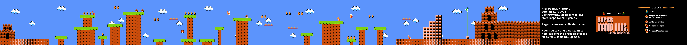

# TURTLE REVENGE - Guía de Diseño de Juego
## FICHA DEL JUEGO
* **Título:** Turtle Revenge - La venganza de las tortugas
* **Género:** Plataformas
* **Audiencia:** Frikies de Ninja Teenage Turtles y Mario Bross con ganas de guasa
* **Plataformas:** Aún por definir
* **Modos de juego:** Jugador único
* **Temática:** Ninja Teenage Turtles y Mario Bross
* **Estética:** Dibujos animados

## DESCRIPCIÓN DEL JUEGO

Turtles revenge es un juego donde controlamos a una tortuga ninja por los mundos de Mario Bross. Mario Bross ha atacado a familiares de las tortugas ninja y éstas quieren venganza. Durante los distintos mundos, las tortugas ninjas deberán hacer frente a los mismos enemigos que Mario Bross a excepción de los de su misma raza. Asimismo, también tendrá que sortear caídas al vacío por lo que deberá estar muy atento al escenario.

## PERSONAJES

**Héroe:** Teenage Ninja Turtles: Michelangello, Donatello, Raphael y Leonardo. Aunque en la demo sólo veremos uno de ellos.
**Amigos:** Tortugas que pululan por el escenario. Simplemente te saludan al pasar.
**Villanos:**
* Las setas: Enemigos que se mueven por el escenario y que sólo con rozarte te pueden matar. No tienen IA y se les mata atacando en su dirección cuando están los suficientemente cerca o saltando sobre ellos. Están en todos los niveles.
* Plantas carnívoras: Salen de algunas tuberías y se mueven arriba y abajo. Te matan con sólo tocarte. No se les puede matar. Hay que evitarlas a toda costa. Aparecen en el nivel 2.

## MECÁNICAS DE JUEGO

* **Movimiento del héroe:** Se usarán los siguientes controles para manejar al héroe principal:
    * **Cursor arriba:** Saltar
    * **Cursor izquierda:** Mover/dirigir héroe a la izquierda
    * **Cursor derecha:** Mover/dirigir héroe a la derecha
    * **Barra espaciadora:** Acción de atacar
* **Control automático del juego:** Existen algunas acciones que el juego controlará automáticamente:
    * **Máxima altura de salto:** Si el jugador mantiene pulsado la barra espaciadora, tendrá un límite de salto donde el sistema hará que el héroe empiece a caer de nuevo.
    * **Colisiones con objetos del escenario:**
        * Si el héroe está elevándose y choca por arriba con un elemento del escenario, empezará a caer.
        * Si el héroe está cayendo y choca por debajo con un elemento del escenario, se posicionará encima de éste.
    * **Colisiones con enemigos:** El jugador cobrará puntos por cada enemigo que mate.
        * Si el héroe está cayendo sobre una seta, muere la seta.
        * Si el héroe está atacando hacia el lado de una seta, muere la seta.
        * Si el héroe toca por cualquier lado con una planta carnívora, muere el héroe.
        * Si la seta toca por un lado al héroe y éste no está atacando hacia ese lado, muere el héroe.
    * **Colisiones con entradas a portal de siguiente nivel o con bandera final:** Se avanzará nivel, repintando el escenario completo con los enemigos y el héroe. Si el paso es a través de una bandera, el jugador cobrará puntos cuanto más arriba se enganche a la bandera.
* **Alimento:** Las tortugas necesitan alimentarse y para ello disponen durante el recorrido de trozos de pizza.
* **Powerups:** Existen cápsulas sorpresa donde se pueden recolectar trozos de pizza u otros powerups.
* **Caídas al vacío:** Existen huecos en los escenarios por donde puede caer el héroe y por tanto perder la vida.
* **Vidas:** El jugador empieza con el héroe y una vida extra. Cada paso de nivel, verá incrementado en 1 las vidas disponibles. Cada final de nivel, cobrará puntos por las vidas extras que tenga disponibles.
* **Tiempo disponible:** Cada nivel tendrá su tiempo disponible para su recorrido. Si el jugador no termina a tiempo, perderá la vida. Si al jugador le sobra tiempo al final del nivel, cobrará un premio por cada segundo restante.
* **Niveles:** La versión de prueba tiene 3 niveles. El nivel 2 está dividido en tres subsecciones.
    * **Nivel 1 original:** no se diseña la parte extra subterránea en la demo. Se sustituyen las monedas del juego de Mario Bross por trozos de pizza para adaptarlo al nuevo héroe.
    
    * **Nivel 2 original:** no se diseña la parte extra subterránea dentro del subterráneo principal, en la demo. Se sustituyen las monedas del juego de Mario Bross por trozos de pizza para adaptarlo al nuevo héroe. No se plantean los ascensores porque las tortugas saltan más que Mario y no son necesarios.
    
    * **Nivel 3 original:** No se añaden las tortugas voladoras porque son irrelevantes. Se sustituyen las monedas del juego de Mario Bross por trozos de pizza para adaptarlo al nuevo héroe.
    
* **Sonidos:**
    * **Música:** Existen varias melodías extraídas del juego de Mario Bross
        * Una música para los menús
        * Una música para el juego
        * Una música para el final del juego
        * Una música para cuando se pierden todas las vidas
    * **Efectos de sonido:**
        * Salto del héroe
        * Caída al piso del héroe (después del salto)
        * Ataque del héroe
        * Muerte del héroe
        * Muerte de la seta
        * Saludo de las otras tortugas
        * Premio (cuando coges un trozo de pizza o un powerup)